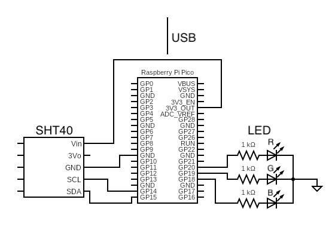
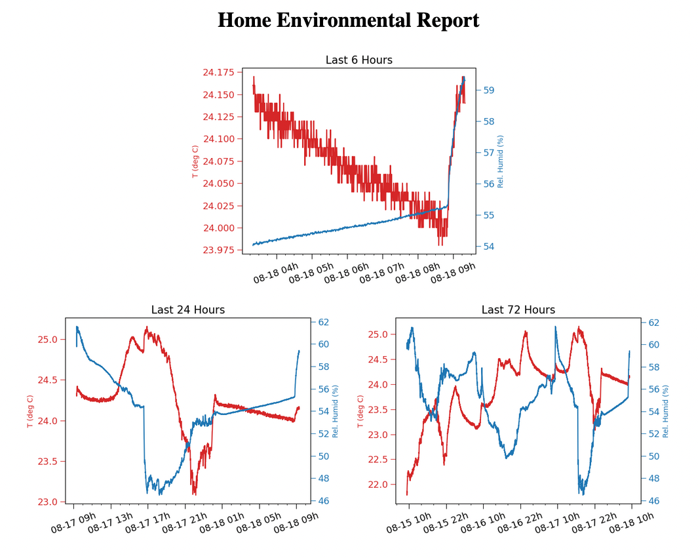

# Picotemp - A simple home weather monitor

Picotemp is a simple home temperature monitor based on a Raspberry Pi Pico. The pico with a SHT40 reports the ambient temperature and humidity via an LED and over a serial connection. If the data is recorded over the serial connection, I include some optional analysis code in python that can produce plots for a basic localhost HTML monitoring page. 

---

The pico circuit contains:

- Raspberry Pi Pico
- Adafruit SHT40 Humidity & Temperature Sensor Package
- Tricolour LED
- 3 - 1K Ohm resistors

The circuit is summarized in the following diagram.

As written and connected as above, the tricolour LED will glow,

- Blue: <20&deg;C
- Blue-Green: 20-21&deg;C 
- Green: 21-22&deg;C 
- Green-Red: 22-23&deg;C 
- Red: >23&deg;C 

Set up your build environment as described in the [Pico Getting Started Datasheet](https://datasheets.raspberrypi.com/pico/getting-started-with-pico.pdf). As a brief, incomplete summary:

1. Download and install build tools & pico-sdk
2. Set up the pico-sdk environment variable
3. Create build directory and `cd`
4. `cmake ..`
5. `make -j4`
6. Connect pico via USB in BOOTSEL mode
7. Drag and drop created readtemp.uf2 file onto pico

The serial connection with the Pico can be read using minicom,

`minicom -b 115200 -D /dev/ttyACM0 -C env.log -O timestamp`

This will produce output like,

`[Timestamp] [Temperature] [Humidity]`

which can be parsed by analysis.py.

Running web/server.py in the background will start a localserver that will show figures of the last 6, 24, and 72 hours of environmental data. I suggest adding a cronjob that runs analysis.py every 15 or so minutes to update these plots automatically.

The result is a simple local webpage as in the image below.

